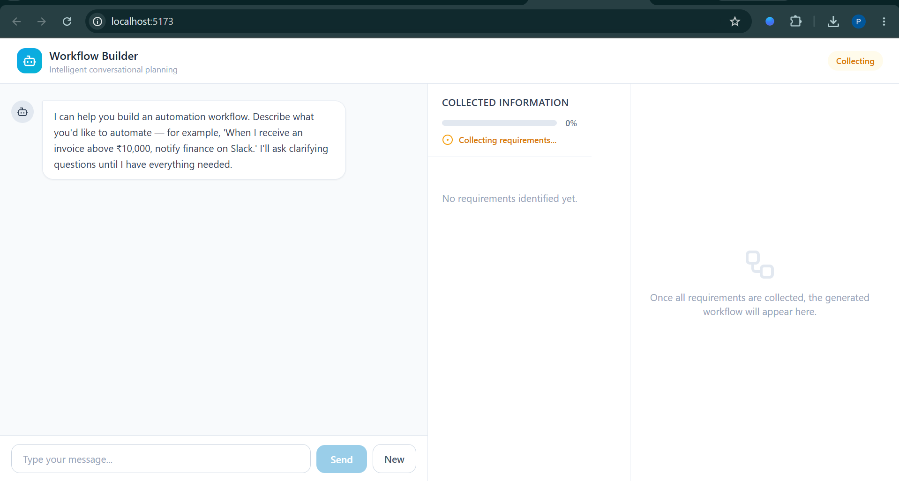
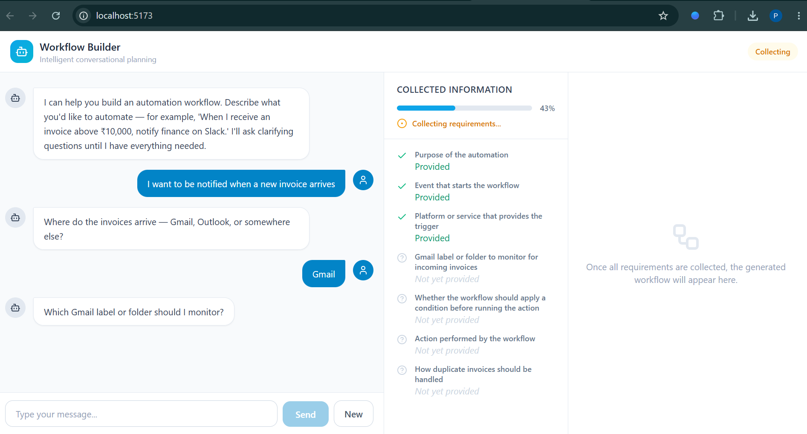
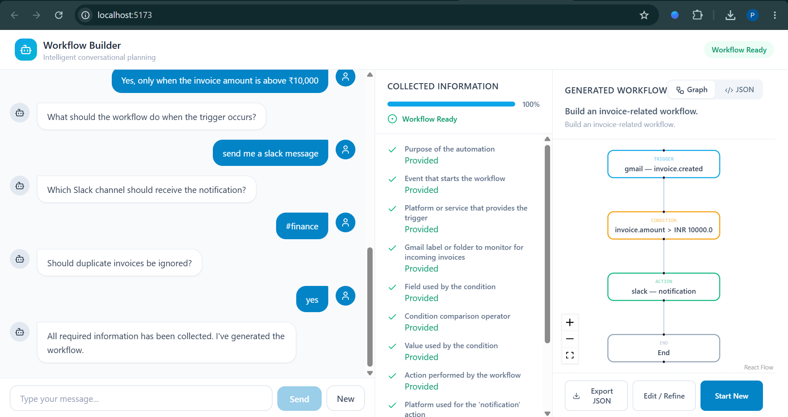

# Digitomics Conversational Workflow Builder

An AI-powered conversational workflow builder that converts natural-language automation requests into structured workflows through iterative clarification.

The core principle is:

> **Do not assume missing information. Ask for it, validate it, and generate the workflow only when the required information is complete.**

This project was developed as an AI Engineer Intern assignment for Digitomics.

---

## 1. Overview

Traditional workflow builders often require users to manually configure triggers, conditions, actions, and destinations.

This project explores a conversational approach:

```text
User describes an automation
          ↓
System understands the request
          ↓
Extracts available information
          ↓
Checks required information
          ↓
Asks a targeted clarification question
          ↓
Updates workflow state
          ↓
Repeats until complete
          ↓
Validates the workflow
          ↓
Generates structured workflow
          ↓
Visualizes the workflow
```

The application does **not execute external integrations**. It generates and visualizes a workflow plan.

---

## 2. Key Features

- Natural-language workflow requests
- Progressive clarification
- Requirement tracking
- Missing-information detection
- Ambiguity handling
- Conflict detection
- Dependency-aware question selection
- Intent, trigger, condition, action and destination extraction
- Duplicate-handling requirement
- Workflow validation
- Structured workflow generation
- React Flow visualization
- Conversation persistence
- Backend-owned reasoning
- Deterministic rule-based provider
- Unit and integration tests

---

## 3. Example Conversation

### User

> I want to be notified when a new invoice arrives.

The system does not immediately generate a workflow because important information is missing.

It progressively collects:

```text
Trigger Source      → Gmail
Monitor Location    → Invoices
Condition           → Invoice amount > ₹10,000
Action              → Send a Slack message
Destination         → #finance
Duplicate Handling  → Ignore duplicate invoices
```

After the required information is collected, the system generates:

```text
Gmail
  │
  ▼
Invoice Created
  │
  ▼
Amount > ₹10,000
  │
  ▼
Slack → #finance
  │
  ▼
End
```

The workflow is represented as structured JSON and visualized in the frontend.

---
## 4. Application Screenshots

### Conversational Requirement Gathering

The system progressively collects missing information instead of generating a workflow immediately.



### Collected Information

The state panel shows which requirements have been satisfied and which information is still missing.



### Generated Workflow

Once all required information is collected, the system generates the workflow and displays it visually using React Flow.



## 5. Architecture

```text
                         ┌──────────────────────┐
                         │        User          │
                         └──────────┬───────────┘
                                    │
                                    ▼
                         ┌──────────────────────┐
                         │ React + TypeScript   │
                         │      Frontend        │
                         └──────────┬───────────┘
                                    │ REST API
                                    ▼
                         ┌──────────────────────┐
                         │       FastAPI        │
                         └──────────┬───────────┘
                                    │
                                    ▼
                    ┌──────────────────────────────┐
                    │ Conversation Orchestrator   │
                    └──────────────┬───────────────┘
                                   │
          ┌────────────────────────┼────────────────────────┐
          ▼                        ▼                        ▼
   ┌──────────────┐       ┌────────────────┐       ┌───────────────┐
   │  Extraction  │       │ Normalization  │       │ Requirements  │
   └──────────────┘       └────────────────┘       └───────────────┘
                                                            │
                                                            ▼
                                                   ┌────────────────┐
                                                   │ Question       │
                                                   │ Planner        │
                                                   └───────┬────────┘
                                                           │
                                                    Missing / Ambiguous
                                                           │
                                                           ▼
                                                     Ask User
                                                           │
                                                           └── repeat

                     When requirements are complete
                                   │
                                   ▼
                         ┌──────────────────────┐
                         │ Workflow Validation │
                         └──────────┬───────────┘
                                    ▼
                         ┌──────────────────────┐
                         │ Workflow Generation │
                         └──────────┬───────────┘
                                    ▼
                         ┌──────────────────────┐
                         │ Structured Workflow │
                         └──────────┬───────────┘
                                    ▼
                         ┌──────────────────────┐
                         │ React Flow Display   │
                         └──────────────────────┘

                         PostgreSQL / Supabase
                         stores conversations,
                         state and generated workflow
```

[View Detailed System Architecture](docs/architecture/architecture.png)

### Architectural principle

The **backend is the source of truth** for:

- conversation reasoning
- requirement evaluation
- clarification questions
- workflow readiness
- workflow generation

The frontend is responsible primarily for:

- user interaction
- displaying conversation
- displaying current state
- visualizing the generated workflow

---

## 6. How the Reasoning Loop Works

Every user message follows a structured pipeline:

```text
User Message
     ↓
Intent / Fact Extraction
     ↓
Normalization
     ↓
Merge into Workflow State
     ↓
Evaluate Requirements
     ↓
Check Ambiguities / Conflicts
     ↓
Select Next Question
     ↓
If information is missing → Ask user
     ↓
If complete → Validate
     ↓
Generate Workflow
```

The system therefore treats workflow creation as a **requirement-gathering problem**, rather than a one-shot text-to-workflow conversion.

---

## 7. Requirement States

Each requirement can have one of the following states:

```text
missing
satisfied
ambiguous
conflicting
```

This distinguishes between:

- information that has not been provided
- information that is sufficiently known
- information that has multiple possible interpretations
- information that contradicts previously collected information

Requirements can also depend on other requirements.

Example:

```text
Trigger Provider
       ↓
Gmail Monitor Location
```

The system should not ask for the Gmail label/folder before knowing that Gmail is the selected provider.

---

## 8. Clarification Strategy

The question planner uses requirement priority and dependencies to select the next useful question.

Example ordering:

```text
Trigger Type       → priority 20
Trigger Provider   → priority 30
Trigger Location   → priority 35
Condition          → priority 40
Action             → priority 60
Action Provider    → priority 70
Destination        → priority 80
Duplicate Handling → priority 90
```

This produces a progressive conversation instead of asking the user for everything at once.

---

## 9. Core Backend Services

The backend separates responsibilities into focused services:

```text
conversation_orchestrator.py
        │
        ├── extraction_service.py
        ├── normalization_service.py
        ├── requirement_service.py
        ├── question_service.py
        ├── ambiguity_service.py
        ├── validation_service.py
        └── workflow_service.py
```

### Extraction Service
Extracts structured facts such as intent, trigger, provider, condition, action, destination, and duplicate handling.

### Normalization Service
Converts extracted information into canonical workflow state and merges new information with existing state.

### Requirement Service
Determines which required pieces are satisfied, missing, ambiguous, or conflicting.

### Question Service
Selects the next eligible requirement and generates the clarification question.

### Ambiguity Service
Handles information that cannot safely be interpreted as a single value.

### Validation Service
Checks whether the collected workflow state is valid before generation.

### Workflow Service
Converts the validated state into the final structured workflow representation.

---

## 10. LLM / Provider Architecture

The project contains a provider abstraction:

```text
backend/app/llm/
├── base.py
├── provider.py
└── rule_based.py
```

The current implementation uses a **deterministic rule-based provider**.

The provider boundary is intentionally separated so that a future LLM-based implementation can be introduced without redesigning the complete orchestration layer.

This also makes the current implementation easier to test and reproduce consistently.

---

## 11. Workflow Representation

A generated workflow contains nodes and edges.

Example:

```json
{
  "nodes": [
    {
      "id": "trigger_1",
      "type": "trigger",
      "label": "gmail — invoice.created"
    },
    {
      "id": "condition_1",
      "type": "condition",
      "label": "invoice.amount > INR 10000"
    },
    {
      "id": "action_1",
      "type": "action",
      "label": "slack — notification"
    },
    {
      "id": "end_1",
      "type": "end",
      "label": "End"
    }
  ],
  "edges": [
    {
      "from_node": "trigger_1",
      "to_node": "condition_1"
    },
    {
      "from_node": "condition_1",
      "to_node": "action_1"
    },
    {
      "from_node": "action_1",
      "to_node": "end_1"
    }
  ]
}
```

The frontend maps this representation into React Flow nodes and edges.

---

## 12. Tech Stack

### Frontend
- React
- TypeScript
- Vite
- Tailwind CSS
- React Flow

### Backend
- Python
- FastAPI
- Pydantic
- SQLAlchemy
- Uvicorn

### Database
- PostgreSQL
- Supabase
- SQLAlchemy ORM

### Testing
- Pytest

---

## 13. Project Structure

[View Project Structure](docs/structure.md)

---

## 14. Frontend Components

### `ChatPanel.tsx`
Handles user messages, assistant responses, message input, loading state, and communication with the backend.

### `StatePanel.tsx`
Displays the current workflow state and collected requirements.

### `WorkflowPanel.tsx`
Displays the generated workflow using React Flow.

### `api.ts`
Contains frontend-to-backend API communication.

### `types.ts`
Contains TypeScript representations of backend response structures.

The frontend does **not** contain an independent workflow planner or fallback reasoning implementation.

---

## 15. Backend API Flow

A typical interaction follows:

```text
POST message
      ↓
Load conversation
      ↓
Process message
      ↓
Update workflow state
      ↓
Evaluate requirements
      ↓
Return next question OR generated workflow
      ↓
Persist conversation
```

The backend response contains the current conversational state and, when ready, the generated workflow.

---

## 16. Database Persistence

Conversation information is persisted in PostgreSQL through SQLAlchemy.

The conversation model stores:

- conversation ID
- title
- messages
- workflow state
- generated workflow
- status
- creation timestamp
- update timestamp

Supabase provides the hosted PostgreSQL database used by the application.

---

## 17. Setup

### Prerequisites

Install:

- Python
- Node.js / npm
- PostgreSQL-compatible database access
- Git

### Backend

Create a virtual environment:

```bash
python -m venv venv
```

Activate it on Windows:

```bash
venv\Scripts\activate
```

Install the backend dependencies from the dependency file included in the repository.

Configure the database connection through the project's environment configuration.

Start the backend:

From the **project root**, we can start backend using this

```bash
set PYTHONPATH=backend
python -m uvicorn app.main:app --reload
```

The API should be available at:

```text
http://127.0.0.1:8000
```

FastAPI documentation:

API endpoints can also be tested through FastAPI Swagger UI at

```text
http://127.0.0.1:8000/docs
```

### Frontend

Install frontend dependencies:

```bash
npm install
```

Start the Vite development server:

```bash
npm run dev
```

Open the local URL shown by Vite.

> Never commit database passwords, API keys, or other secrets to the repository. Use environment variables for local configuration.

---

## 18. Testing

Run the complete test suite from the project root:

```bash
set PYTHONPATH=backend
python -m pytest tests -v
```

Tests cover:

- extraction
- normalization
- requirement evaluation
- question selection
- ambiguity handling
- workflow generation
- conversation integration
- schema validation

### Test Result

✅ **53 tests passed**

```text
53 passed in 0.57s
```

## 19. Example End-to-End Flow

```text
User:
"I want to be notified when a new invoice arrives."

Assistant:
"Which service should I monitor?"

User:
"Gmail"

Assistant:
"Which Gmail label or folder should I monitor?"

User:
"Invoices"

Assistant:
"Should I apply a condition, such as a minimum invoice amount?"

User:
"Yes, only when the invoice amount is above ₹10,000."

Assistant:
"Which notification action should I use?"

User:
"Send a Slack message."

Assistant:
"Which Slack channel should receive it?"

User:
"#finance"

Assistant:
"Should duplicate invoices be ignored?"

User:
"Yes"
```

At this point the system has enough information to generate the workflow.

Final collected state includes:

```text
Intent
Trigger
Trigger Provider
Monitor Location
Condition
Action
Action Provider
Destination
Duplicate Handling
```

The final workflow status becomes:

```text
generated
```

---

## 20. Scope and Limitations

### Implemented

- Conversational requirement gathering
- Progressive clarification
- Requirement dependency handling
- Missing information detection
- Ambiguity handling
- Conflict handling
- Structured workflow state
- Workflow validation
- Workflow generation
- Workflow visualization
- Conversation persistence
- Automated testing

### Intentionally Not Implemented

The application does not execute real external workflows.

For example, it does not:

- connect to Gmail
- send real Slack messages
- process real invoices
- execute third-party automation APIs

The assignment focuses on **understanding the user's automation intent, collecting requirements, and generating a complete workflow plan**.

---

## 21. Key Engineering Decisions

### Backend as the source of truth

Reasoning and workflow state are kept in the backend instead of duplicating the logic in the frontend.

This prevents frontend and backend workflow decisions from becoming inconsistent.

### Progressive clarification

The system does not try to generate a workflow from incomplete information.

```text
Understand → Check → Clarify → Update → Check again
```

### Deterministic workflow generation

Once requirements are satisfied and validated, workflow generation is based on structured state rather than free-form text.

### Provider abstraction

The LLM/provider layer is isolated so the current deterministic implementation can later be replaced or extended with an actual LLM without changing the core orchestration architecture.

### Independent services

Extraction, normalization, requirements, questions, validation and workflow generation are separated into individual services.

This improves maintainability, testability, debugging, and future extensibility.

---

## 22. Future Improvements

Possible future extensions include:

- LLM-based extraction
- LLM-assisted ambiguity resolution
- More trigger and action types
- Richer workflow conditions
- Workflow editing after generation
- Workflow versioning
- Authentication and user accounts
- More provider-specific configuration
- Export to automation platforms
- Actual workflow execution through integrations

These are outside the current assignment scope.

---

## 23. Conclusion

This project demonstrates a conversational approach to workflow building where the system focuses on:

**understanding → clarification → validation → structured generation**

The key design goal is to avoid silently guessing missing information.

```text
Natural Language
      ↓
Structured Understanding
      ↓
Requirement Collection
      ↓
Clarification
      ↓
Validation
      ↓
Workflow Generation
      ↓
Visualization
```

The resulting architecture keeps reasoning centralized in the backend while keeping the frontend focused on interaction and visualization.

---

## 24. Assignment Submission

This repository contains:

- Complete source code
- Backend and frontend implementation
- Database migration
- Automated tests
- README documentation
- Workflow architecture and implementation

---

### Built by

**Pavan Kumar Kollipara**  
Computer Science Engineer